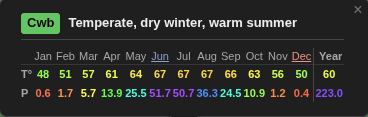
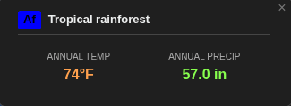
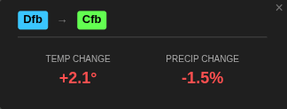

1991-2020 set view:

- Click the tooltip header to toggle koppen view
- Click the month with red text to show the driest month layer
- CLick the month with blue text to show the wettest month layer
- Click either number in the year column to show the yearly average or total layer 
- Click a monthly figure to see the monthly temperature or precipitation layer

Historical set view:

- Select by choosing a historical set in the left dropdown
- Same Köppen layer as modern view, monthly chart is removed and only the average/total is shown

Comparison view:

- Select by choosing a different set in the right dropdown
- Click the header to show change in Köppen zones
- Click either of the yearly figures to show the change in temperature or precipitation

Data used:
Beck, H. E., T. R. McVicar, N. Vergopolan, A. Berg, N. J. Lutsko, A. Dufour, Z. Zeng, X. Jiang, A. I. J. M. van Dijk, and D. G. Miralles. [High-resolution (1 km) Köppen-Geiger maps for 1901–2099 based on constrained CMIP6 projections](https://www.nature.com/articles/s41597-023-02549-6). Scientific Data 10, 724 (2023).

Inspired by [koppen.earth](https://koppen.earth)
Created with [Google Antigravity](https://antigravity.google.com/)